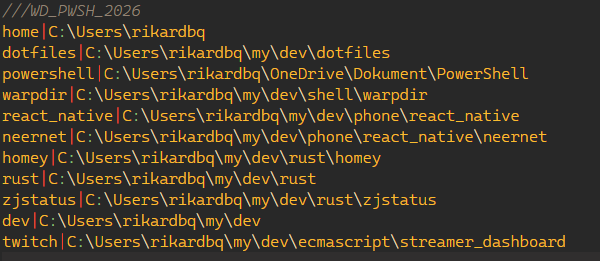
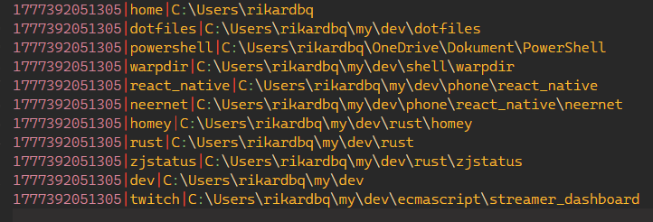

## WarpDir pwsh
Put the WarpDir folder into one of the Powershell module paths, you can find them here `$env:PSModulePath`\
Then in your `$PROFILE` file just add `Import-Module -Name WarpDir`\
Any config will be located at `$HOME/.wd/`

## Breaking change in commit _**dc09d6a**_ (added timestamps)
### _**\#\#\# YOU ONLY NEED TO DO THIS IF YOU USED WarpDir BEFORE THIS COMMIT \#\#\#**_
Your config should look something like this

In order to migrate the conf to the new format, run the following:

`cp ~/.wd/dirs ~/.wd/dirs_bkp && Write-Output $((Get-Content -Path "$HOME/.wd/dirs").Split("\r\n") | ForEach-Object { if ($_.Split("|").Count -eq 3) { break; } if ($_ -ne "///WD_PWSH_2026") { "$([System.DateTimeOffset]::Now.ToUnixTimeMilliseconds())|$_" } else { "$_" }}) > ~/.wd/dirs`

Config should look something like this afterwards

